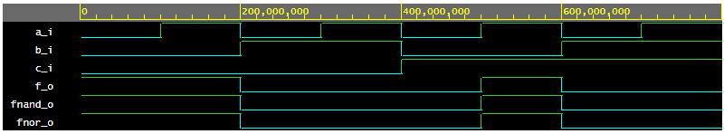
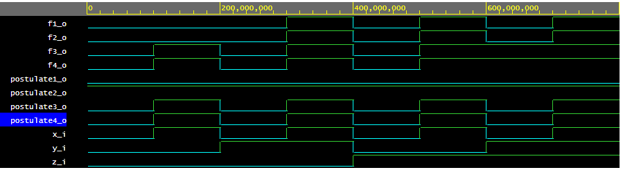

# Lab 01-gates

**[GitHub repository](https://github.com/mkousal/Digital-electronics-1)**

## De Morgan laws
### Function table

| **c** | **b** |**a** | **f(c,b,a)** |
| :-: | :-: | :-: | :-: |
| 0 | 0 | 0 | 1 |
| 0 | 0 | 1 | 1 |
| 0 | 1 | 0 | 0 |
| 0 | 1 | 1 | 0 |
| 1 | 0 | 0 | 0 |
| 1 | 0 | 1 | 1 |
| 1 | 1 | 0 | 0 |
| 1 | 1 | 1 | 0 |

### VHDL code for De Morgan laws

```vhdl
------------------------------------------------------------------------
--
-- Example of basic OR, AND, XOR gates.
-- Nexys A7-50T, Vivado v2020.1, EDA Playground
--
-- Copyright (c) 2019-2020 Tomas Fryza
-- Dept. of Radio Electronics, Brno University of Technology, Czechia
-- This work is licensed under the terms of the MIT license.
--
------------------------------------------------------------------------

library ieee;               -- Standard library
use ieee.std_logic_1164.all;-- Package for data types and logic operations

------------------------------------------------------------------------
-- Entity declaration for basic gates
------------------------------------------------------------------------
entity gates is
    port(
        a_i    : in  std_logic;         -- Data input
        b_i    : in  std_logic;         -- Data input
        c_i    : in  std_logic;			-- Data input
        
        f_o    : out std_logic;			-- function output
        fnand_o : out std_logic;		-- NAND function output
        fnor_o : out std_logic;			-- NOR function
        
        for_o  : out std_logic;         -- OR output function
        fand_o : out std_logic;         -- AND output function
        fxor_o : out std_logic          -- XOR output function
    );
end entity gates;

------------------------------------------------------------------------
-- Architecture body for basic gates
------------------------------------------------------------------------
architecture dataflow of gates is
begin
	f_o <= ((not b_i) and a_i) or ((not c_i) and (not b_i));
    fnand_o <= ((b_i nand b_i) nand a_i) nand ((c_i nand c_i) nand (b_i nand b_i));    
    fnor_o <= (((a_i nor a_i) nor b_i) nor (b_i nor c_i)) nor (((a_i nor a_i) nor b_i) nor (b_i nor c_i));
	
    for_o  <= a_i or b_i;
    fand_o <= a_i and b_i;
    fxor_o <= a_i xor b_i;

end architecture dataflow;
```

### Image with waveforms


### EDA Playground
[Link to project](https://www.edaplayground.com/x/bzeH)

## Distribution laws

### VHDL code for Distribution laws
```vhdl
-- Code your design here
library IEEE;
use IEEE.std_logic_1164.all;

entity gates is
	port(
    	x_i	: in std_logic;	-- Input 'x'
        y_i	: in std_logic;	-- Input 'y'
        z_i	: in std_logic;	-- Input 'z'
        
        postulate1_o	: out std_logic;	-- Output first postulate
        postulate2_o	: out std_logic;	-- Output second postulate
        postulate3_o	: out std_logic;	-- Output third postulate
        postulate4_o	: out std_logic;	-- Output fourth postulate
        
        f1_o	: out std_logic;	-- Output left side first law
        f2_o	: out std_logic;	-- Output right side first law
        f3_o	: out std_logic;	-- Output left side second law
        f4_o	: out std_logic		-- Output right side second law
    );
end entity gates;

architecture dataflow of gates is
begin
	postulate1_o <= x_i and (not x_i);
    postulate2_o <= x_i or (not x_i);
    postulate3_o <= x_i or x_i or x_i;
    postulate4_o <= x_i and x_i and x_i;
    
    f1_o <= (x_i and y_i) or (x_i and z_i);
    f2_o <= x_i and (y_i or z_i);
    f3_o <= (x_i or y_i) and (x_i or z_i);
    f4_o <= x_i or (y_i and z_i);
end architecture dataflow;
```

### Image with waveforms


### EDA Playground
[Link to project](https://www.edaplayground.com/x/Qkkb)