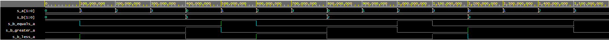

# Lab 02 - Logic

**[GitHub repository](https://github.com/mkousal/Digital-electronics-1)**

## Truth table
| **Dec. equivalent** | **B[1:0]** | **A[1:0]** | **B is greater than A** | **B equals A** | **B is less than A** |
| :-: | :-: | :-: | :-: | :-: | :-: |
|-|**[d:c]**|**[b:a]**|-|-|-|
| 0 | 0 0 | 0 0 | 0 | 1 | 0 |
| 1 | 0 0 | 0 1 | 0 | 0 | 1 |
| 2 | 0 0 | 1 0 | 0 | 0 | 1 |
| 3 | 0 0 | 1 1 | 0 | 0 | 1 |
| 4 | 0 1 | 0 0 | 1 | 0 | 0 |
| 5 | 0 1 | 0 1 | 0 | 1 | 0 |
| 6 | 0 1 | 1 0 | 0 | 0 | 1 |
| 7 | 0 1 | 1 1 | 0 | 0 | 1 |
| 8 | 1 0 | 0 0 | 1 | 0 | 0 |
| 9 | 1 0 | 0 1 | 1 | 0 | 0 |
| 10 | 1 0 | 1 0 | 0 | 1 | 0 |
| 11 | 1 0 | 1 1 | 0 | 0 | 1 |
| 12 | 1 1 | 0 0 | 1 | 0 | 0 |
| 13 | 1 1 | 0 1 | 1 | 0 | 0 |
| 14 | 1 1 | 1 0 | 1 | 0 | 0 |
| 15 | 1 1 | 1 1 | 0 | 1 | 0 |

<br>


## 2-bit comparator

### K-maps

#### K-map for B is greater than A


#### K-map for B equals A


#### K-map for B is less than A


### Simplified functions


### EDA playground simulation

#### Link
[EDA playground 2-bit comparator](https://www.edaplayground.com/x/KpF6)

#### Simulation results


Log output:
```
[2021-02-17 10:15:17 EST] ghdl -i design.vhd testbench.vhd  && ghdl -m  tb_comparator_2bit && ghdl -r  tb_comparator_2bit   --vcd=dump.vcd && sed -i 's/^U/X/g; s/^-/X/g; s/^H/1/g; s/^L/0/g' dump.vcd 
analyze design.vhd
analyze testbench.vhd
elaborate tb_comparator_2bit
testbench.vhd:51:9:@0ms:(report note): Stimulus process started
testbench.vhd:1088:9:@25600ns:(report note): Stimulus process finished
Finding VCD file...
./dump.vcd
[2021-02-17 10:15:20 EST] Opening EPWave...
Done
```

#### Simulation results with some error


Log output:
```
[2021-02-17 10:23:16 EST] ghdl -i design.vhd testbench.vhd  && ghdl -m  tb_comparator_2bit && ghdl -r  tb_comparator_2bit   --vcd=dump.vcd && sed -i 's/^U/X/g; s/^-/X/g; s/^H/1/g; s/^L/0/g' dump.vcd 
analyze design.vhd
analyze testbench.vhd
elaborate tb_comparator_2bit
testbench.vhd:51:9:@0ms:(report note): Stimulus process started
testbench.vhd:57:9:@100ns:(assertion error): Test failed for input combination: 00, 00
testbench.vhd:62:9:@200ns:(assertion error): Test failed for input combination: 00, 01
testbench.vhd:66:9:@300ns:(assertion error): Test failed for input combination: 00, 10
testbench.vhd:70:9:@400ns:(assertion error): Test failed for input combination: 00, 11
testbench.vhd:78:9:@600ns:(assertion error): Test failed for input combination: 01, 01
testbench.vhd:82:9:@700ns:(assertion error): Test failed for input combination: 01, 10
testbench.vhd:86:9:@800ns:(assertion error): Test failed for input combination: 01, 11
testbench.vhd:98:9:@1100ns:(assertion error): Test failed for input combination: 10, 10
testbench.vhd:102:9:@1200ns:(assertion error): Test failed for input combination: 10, 11
testbench.vhd:118:9:@1600ns:(assertion error): Test failed for input combination: 11, 11
testbench.vhd:125:9:@1600ns:(report note): Stimulus process finished
Finding VCD file...
./dump.vcd
[2021-02-17 10:23:17 EST] Opening EPWave...
Done
```

## 4-bit binary comparator

### EDA playground simulation

#### Link
[EDA playground 4-bit comparator](https://www.edaplayground.com/x/G5sq)

#### Listing of VHDL code (`design.vhd`)
```vhdl
------------------------------------------------------------------------
--
-- Example of 4-bit binary comparator using the when/else assignment.
-- EDA Playground
--
-- Copyright (c) 2020-2021 Tomas Fryza
-- Dept. of Radio Electronics, Brno University of Technology, Czechia
-- This work is licensed under the terms of the MIT license.
--
------------------------------------------------------------------------

library ieee;
use ieee.std_logic_1164.all;

------------------------------------------------------------------------
-- Entity declaration for 4-bit binary comparator
------------------------------------------------------------------------
entity comparator_4bit is
    port(
        a_i           : in  std_logic_vector(4 - 1 downto 0);
		b_i           : in  std_logic_vector(4 - 1 downto 0);

        -- COMPLETE ENTITY DECLARATION


        B_less_A_o    : out std_logic;      -- B is less than A
        B_equals_A_o  : out std_logic;		-- B is equal to A
        B_greater_A_o : out std_logic		-- B is greater than A
        
    );
end entity comparator_4bit;

------------------------------------------------------------------------
-- Architecture body for 4-bit binary comparator
------------------------------------------------------------------------
architecture Behavioral of comparator_4bit is
begin
    B_less_A_o   <= '1' when (b_i < a_i) else '0';
    B_equals_A_o <= '1' when (b_i = a_i) else '0';
    B_greater_A_o <= '1' when (b_i > a_i) else '0';


    -- WRITE "GREATER" AND "EQUALS" ASSIGNMENTS HERE


end architecture Behavioral;
```
#### Listing of VHDL testbench (`testbench.vhd`)
<details>
<summary>Testbench code</summary>

```vhdl
------------------------------------------------------------------------
--
-- Testbench for 4-bit binary comparator.
-- EDA Playground
--
-- Copyright (c) 2020-2021 Tomas Fryza
-- Dept. of Radio Electronics, Brno University of Technology, Czechia
-- This work is licensed under the terms of the MIT license.
--
------------------------------------------------------------------------

library ieee;
use ieee.std_logic_1164.all;

------------------------------------------------------------------------
-- Entity declaration for testbench
------------------------------------------------------------------------
entity tb_comparator_4bit is
    -- Entity of testbench is always empty
end entity tb_comparator_4bit;

------------------------------------------------------------------------
-- Architecture body for testbench
------------------------------------------------------------------------
architecture testbench of tb_comparator_4bit is

    -- Local signals
    signal s_a       : std_logic_vector(4 - 1 downto 0);
    signal s_b       : std_logic_vector(4 - 1 downto 0);
    signal s_B_greater_A : std_logic;
    signal s_B_equals_A  : std_logic;
    signal s_B_less_A    : std_logic;

begin
    -- Connecting testbench signals with comparator_2bit entity (Unit Under Test)
    uut_comparator_4bit : entity work.comparator_4bit
        port map(
            a_i           => s_a,
            b_i           => s_b,
            B_greater_A_o => s_B_greater_A,
            B_equals_A_o  => s_B_equals_A,
            B_less_A_o    => s_B_less_A
        );

    --------------------------------------------------------------------
    -- Data generation process
    --------------------------------------------------------------------
    p_stimulus : process
    begin
        -- Report a note at the begining of stimulus process
        report "Stimulus process started" severity note;


s_b <= "0000"; s_a <= "0000"; wait for 100 ns;
assert ((s_B_greater_A = '0') and (s_B_equals_A = '1') and (s_B_less_A = '0'))
report "Test failed for input combination: 0000, 0000" severity error;

s_b <= "0000"; s_a <= "0001"; wait for 100 ns;
assert ((s_B_greater_A = '0') and (s_B_equals_A = '0') and (s_B_less_A = '1'))
report "Test failed for input combination: 0000, 0001" severity error;

s_b <= "0000"; s_a <= "0010"; wait for 100 ns;
assert ((s_B_greater_A = '0') and (s_B_equals_A = '0') and (s_B_less_A = '1'))
report "Test failed for input combination: 0000, 0010" severity error;

s_b <= "0000"; s_a <= "0011"; wait for 100 ns;
assert ((s_B_greater_A = '0') and (s_B_equals_A = '0') and (s_B_less_A = '1'))
report "Test failed for input combination: 0000, 0011" severity error;

s_b <= "0000"; s_a <= "0100"; wait for 100 ns;
assert ((s_B_greater_A = '0') and (s_B_equals_A = '0') and (s_B_less_A = '1'))
report "Test failed for input combination: 0000, 0100" severity error;

s_b <= "0000"; s_a <= "0101"; wait for 100 ns;
assert ((s_B_greater_A = '0') and (s_B_equals_A = '0') and (s_B_less_A = '1'))
report "Test failed for input combination: 0000, 0101" severity error;

s_b <= "0000"; s_a <= "0110"; wait for 100 ns;
assert ((s_B_greater_A = '0') and (s_B_equals_A = '0') and (s_B_less_A = '1'))
report "Test failed for input combination: 0000, 0110" severity error;

s_b <= "0000"; s_a <= "0111"; wait for 100 ns;
assert ((s_B_greater_A = '0') and (s_B_equals_A = '0') and (s_B_less_A = '1'))
report "Test failed for input combination: 0000, 0111" severity error;

s_b <= "0000"; s_a <= "1000"; wait for 100 ns;
assert ((s_B_greater_A = '0') and (s_B_equals_A = '0') and (s_B_less_A = '1'))
report "Test failed for input combination: 0000, 1000" severity error;

s_b <= "0000"; s_a <= "1001"; wait for 100 ns;
assert ((s_B_greater_A = '0') and (s_B_equals_A = '0') and (s_B_less_A = '1'))
report "Test failed for input combination: 0000, 1001" severity error;

s_b <= "0000"; s_a <= "1010"; wait for 100 ns;
assert ((s_B_greater_A = '0') and (s_B_equals_A = '0') and (s_B_less_A = '1'))
report "Test failed for input combination: 0000, 1010" severity error;

s_b <= "0000"; s_a <= "1011"; wait for 100 ns;
assert ((s_B_greater_A = '0') and (s_B_equals_A = '0') and (s_B_less_A = '1'))
report "Test failed for input combination: 0000, 1011" severity error;

s_b <= "0000"; s_a <= "1100"; wait for 100 ns;
assert ((s_B_greater_A = '0') and (s_B_equals_A = '0') and (s_B_less_A = '1'))
report "Test failed for input combination: 0000, 1100" severity error;

s_b <= "0000"; s_a <= "1101"; wait for 100 ns;
assert ((s_B_greater_A = '0') and (s_B_equals_A = '0') and (s_B_less_A = '1'))
report "Test failed for input combination: 0000, 1101" severity error;

s_b <= "0000"; s_a <= "1110"; wait for 100 ns;
assert ((s_B_greater_A = '0') and (s_B_equals_A = '0') and (s_B_less_A = '1'))
report "Test failed for input combination: 0000, 1110" severity error;

s_b <= "0000"; s_a <= "1111"; wait for 100 ns;
assert ((s_B_greater_A = '0') and (s_B_equals_A = '0') and (s_B_less_A = '1'))
report "Test failed for input combination: 0000, 1111" severity error;

s_b <= "0001"; s_a <= "0000"; wait for 100 ns;
assert ((s_B_greater_A = '1') and (s_B_equals_A = '0') and (s_B_less_A = '0'))
report "Test failed for input combination: 0001, 0000" severity error;

s_b <= "0001"; s_a <= "0001"; wait for 100 ns;
assert ((s_B_greater_A = '0') and (s_B_equals_A = '1') and (s_B_less_A = '0'))
report "Test failed for input combination: 0001, 0001" severity error;

s_b <= "0001"; s_a <= "0010"; wait for 100 ns;
assert ((s_B_greater_A = '0') and (s_B_equals_A = '0') and (s_B_less_A = '1'))
report "Test failed for input combination: 0001, 0010" severity error;

s_b <= "0001"; s_a <= "0011"; wait for 100 ns;
assert ((s_B_greater_A = '0') and (s_B_equals_A = '0') and (s_B_less_A = '1'))
report "Test failed for input combination: 0001, 0011" severity error;

s_b <= "0001"; s_a <= "0100"; wait for 100 ns;
assert ((s_B_greater_A = '0') and (s_B_equals_A = '0') and (s_B_less_A = '1'))
report "Test failed for input combination: 0001, 0100" severity error;

s_b <= "0001"; s_a <= "0101"; wait for 100 ns;
assert ((s_B_greater_A = '0') and (s_B_equals_A = '0') and (s_B_less_A = '1'))
report "Test failed for input combination: 0001, 0101" severity error;

s_b <= "0001"; s_a <= "0110"; wait for 100 ns;
assert ((s_B_greater_A = '0') and (s_B_equals_A = '0') and (s_B_less_A = '1'))
report "Test failed for input combination: 0001, 0110" severity error;

s_b <= "0001"; s_a <= "0111"; wait for 100 ns;
assert ((s_B_greater_A = '0') and (s_B_equals_A = '0') and (s_B_less_A = '1'))
report "Test failed for input combination: 0001, 0111" severity error;

s_b <= "0001"; s_a <= "1000"; wait for 100 ns;
assert ((s_B_greater_A = '0') and (s_B_equals_A = '0') and (s_B_less_A = '1'))
report "Test failed for input combination: 0001, 1000" severity error;

s_b <= "0001"; s_a <= "1001"; wait for 100 ns;
assert ((s_B_greater_A = '0') and (s_B_equals_A = '0') and (s_B_less_A = '1'))
report "Test failed for input combination: 0001, 1001" severity error;

s_b <= "0001"; s_a <= "1010"; wait for 100 ns;
assert ((s_B_greater_A = '0') and (s_B_equals_A = '0') and (s_B_less_A = '1'))
report "Test failed for input combination: 0001, 1010" severity error;

s_b <= "0001"; s_a <= "1011"; wait for 100 ns;
assert ((s_B_greater_A = '0') and (s_B_equals_A = '0') and (s_B_less_A = '1'))
report "Test failed for input combination: 0001, 1011" severity error;

s_b <= "0001"; s_a <= "1100"; wait for 100 ns;
assert ((s_B_greater_A = '0') and (s_B_equals_A = '0') and (s_B_less_A = '1'))
report "Test failed for input combination: 0001, 1100" severity error;

s_b <= "0001"; s_a <= "1101"; wait for 100 ns;
assert ((s_B_greater_A = '0') and (s_B_equals_A = '0') and (s_B_less_A = '1'))
report "Test failed for input combination: 0001, 1101" severity error;

s_b <= "0001"; s_a <= "1110"; wait for 100 ns;
assert ((s_B_greater_A = '0') and (s_B_equals_A = '0') and (s_B_less_A = '1'))
report "Test failed for input combination: 0001, 1110" severity error;

s_b <= "0001"; s_a <= "1111"; wait for 100 ns;
assert ((s_B_greater_A = '0') and (s_B_equals_A = '0') and (s_B_less_A = '1'))
report "Test failed for input combination: 0001, 1111" severity error;

s_b <= "0010"; s_a <= "0000"; wait for 100 ns;
assert ((s_B_greater_A = '1') and (s_B_equals_A = '0') and (s_B_less_A = '0'))
report "Test failed for input combination: 0010, 0000" severity error;

s_b <= "0010"; s_a <= "0001"; wait for 100 ns;
assert ((s_B_greater_A = '1') and (s_B_equals_A = '0') and (s_B_less_A = '0'))
report "Test failed for input combination: 0010, 0001" severity error;

s_b <= "0010"; s_a <= "0010"; wait for 100 ns;
assert ((s_B_greater_A = '0') and (s_B_equals_A = '1') and (s_B_less_A = '0'))
report "Test failed for input combination: 0010, 0010" severity error;

s_b <= "0010"; s_a <= "0011"; wait for 100 ns;
assert ((s_B_greater_A = '0') and (s_B_equals_A = '0') and (s_B_less_A = '1'))
report "Test failed for input combination: 0010, 0011" severity error;

s_b <= "0010"; s_a <= "0100"; wait for 100 ns;
assert ((s_B_greater_A = '0') and (s_B_equals_A = '0') and (s_B_less_A = '1'))
report "Test failed for input combination: 0010, 0100" severity error;

s_b <= "0010"; s_a <= "0101"; wait for 100 ns;
assert ((s_B_greater_A = '0') and (s_B_equals_A = '0') and (s_B_less_A = '1'))
report "Test failed for input combination: 0010, 0101" severity error;

s_b <= "0010"; s_a <= "0110"; wait for 100 ns;
assert ((s_B_greater_A = '0') and (s_B_equals_A = '0') and (s_B_less_A = '1'))
report "Test failed for input combination: 0010, 0110" severity error;

s_b <= "0010"; s_a <= "0111"; wait for 100 ns;
assert ((s_B_greater_A = '0') and (s_B_equals_A = '0') and (s_B_less_A = '1'))
report "Test failed for input combination: 0010, 0111" severity error;

s_b <= "0010"; s_a <= "1000"; wait for 100 ns;
assert ((s_B_greater_A = '0') and (s_B_equals_A = '0') and (s_B_less_A = '1'))
report "Test failed for input combination: 0010, 1000" severity error;

s_b <= "0010"; s_a <= "1001"; wait for 100 ns;
assert ((s_B_greater_A = '0') and (s_B_equals_A = '0') and (s_B_less_A = '1'))
report "Test failed for input combination: 0010, 1001" severity error;

s_b <= "0010"; s_a <= "1010"; wait for 100 ns;
assert ((s_B_greater_A = '0') and (s_B_equals_A = '0') and (s_B_less_A = '1'))
report "Test failed for input combination: 0010, 1010" severity error;

s_b <= "0010"; s_a <= "1011"; wait for 100 ns;
assert ((s_B_greater_A = '0') and (s_B_equals_A = '0') and (s_B_less_A = '1'))
report "Test failed for input combination: 0010, 1011" severity error;

s_b <= "0010"; s_a <= "1100"; wait for 100 ns;
assert ((s_B_greater_A = '0') and (s_B_equals_A = '0') and (s_B_less_A = '1'))
report "Test failed for input combination: 0010, 1100" severity error;

s_b <= "0010"; s_a <= "1101"; wait for 100 ns;
assert ((s_B_greater_A = '0') and (s_B_equals_A = '0') and (s_B_less_A = '1'))
report "Test failed for input combination: 0010, 1101" severity error;

s_b <= "0010"; s_a <= "1110"; wait for 100 ns;
assert ((s_B_greater_A = '0') and (s_B_equals_A = '0') and (s_B_less_A = '1'))
report "Test failed for input combination: 0010, 1110" severity error;

s_b <= "0010"; s_a <= "1111"; wait for 100 ns;
assert ((s_B_greater_A = '0') and (s_B_equals_A = '0') and (s_B_less_A = '1'))
report "Test failed for input combination: 0010, 1111" severity error;

s_b <= "0011"; s_a <= "0000"; wait for 100 ns;
assert ((s_B_greater_A = '1') and (s_B_equals_A = '0') and (s_B_less_A = '0'))
report "Test failed for input combination: 0011, 0000" severity error;

s_b <= "0011"; s_a <= "0001"; wait for 100 ns;
assert ((s_B_greater_A = '1') and (s_B_equals_A = '0') and (s_B_less_A = '0'))
report "Test failed for input combination: 0011, 0001" severity error;

s_b <= "0011"; s_a <= "0010"; wait for 100 ns;
assert ((s_B_greater_A = '1') and (s_B_equals_A = '0') and (s_B_less_A = '0'))
report "Test failed for input combination: 0011, 0010" severity error;

s_b <= "0011"; s_a <= "0011"; wait for 100 ns;
assert ((s_B_greater_A = '0') and (s_B_equals_A = '1') and (s_B_less_A = '0'))
report "Test failed for input combination: 0011, 0011" severity error;

s_b <= "0011"; s_a <= "0100"; wait for 100 ns;
assert ((s_B_greater_A = '0') and (s_B_equals_A = '0') and (s_B_less_A = '1'))
report "Test failed for input combination: 0011, 0100" severity error;

s_b <= "0011"; s_a <= "0101"; wait for 100 ns;
assert ((s_B_greater_A = '0') and (s_B_equals_A = '0') and (s_B_less_A = '1'))
report "Test failed for input combination: 0011, 0101" severity error;

s_b <= "0011"; s_a <= "0110"; wait for 100 ns;
assert ((s_B_greater_A = '0') and (s_B_equals_A = '0') and (s_B_less_A = '1'))
report "Test failed for input combination: 0011, 0110" severity error;

s_b <= "0011"; s_a <= "0111"; wait for 100 ns;
assert ((s_B_greater_A = '0') and (s_B_equals_A = '0') and (s_B_less_A = '1'))
report "Test failed for input combination: 0011, 0111" severity error;

s_b <= "0011"; s_a <= "1000"; wait for 100 ns;
assert ((s_B_greater_A = '0') and (s_B_equals_A = '0') and (s_B_less_A = '1'))
report "Test failed for input combination: 0011, 1000" severity error;

s_b <= "0011"; s_a <= "1001"; wait for 100 ns;
assert ((s_B_greater_A = '0') and (s_B_equals_A = '0') and (s_B_less_A = '1'))
report "Test failed for input combination: 0011, 1001" severity error;

s_b <= "0011"; s_a <= "1010"; wait for 100 ns;
assert ((s_B_greater_A = '0') and (s_B_equals_A = '0') and (s_B_less_A = '1'))
report "Test failed for input combination: 0011, 1010" severity error;

s_b <= "0011"; s_a <= "1011"; wait for 100 ns;
assert ((s_B_greater_A = '0') and (s_B_equals_A = '0') and (s_B_less_A = '1'))
report "Test failed for input combination: 0011, 1011" severity error;

s_b <= "0011"; s_a <= "1100"; wait for 100 ns;
assert ((s_B_greater_A = '0') and (s_B_equals_A = '0') and (s_B_less_A = '1'))
report "Test failed for input combination: 0011, 1100" severity error;

s_b <= "0011"; s_a <= "1101"; wait for 100 ns;
assert ((s_B_greater_A = '0') and (s_B_equals_A = '0') and (s_B_less_A = '1'))
report "Test failed for input combination: 0011, 1101" severity error;

s_b <= "0011"; s_a <= "1110"; wait for 100 ns;
assert ((s_B_greater_A = '0') and (s_B_equals_A = '0') and (s_B_less_A = '1'))
report "Test failed for input combination: 0011, 1110" severity error;

s_b <= "0011"; s_a <= "1111"; wait for 100 ns;
assert ((s_B_greater_A = '0') and (s_B_equals_A = '0') and (s_B_less_A = '1'))
report "Test failed for input combination: 0011, 1111" severity error;

s_b <= "0100"; s_a <= "0000"; wait for 100 ns;
assert ((s_B_greater_A = '1') and (s_B_equals_A = '0') and (s_B_less_A = '0'))
report "Test failed for input combination: 0100, 0000" severity error;

s_b <= "0100"; s_a <= "0001"; wait for 100 ns;
assert ((s_B_greater_A = '1') and (s_B_equals_A = '0') and (s_B_less_A = '0'))
report "Test failed for input combination: 0100, 0001" severity error;

s_b <= "0100"; s_a <= "0010"; wait for 100 ns;
assert ((s_B_greater_A = '1') and (s_B_equals_A = '0') and (s_B_less_A = '0'))
report "Test failed for input combination: 0100, 0010" severity error;

s_b <= "0100"; s_a <= "0011"; wait for 100 ns;
assert ((s_B_greater_A = '1') and (s_B_equals_A = '0') and (s_B_less_A = '0'))
report "Test failed for input combination: 0100, 0011" severity error;

s_b <= "0100"; s_a <= "0100"; wait for 100 ns;
assert ((s_B_greater_A = '0') and (s_B_equals_A = '1') and (s_B_less_A = '0'))
report "Test failed for input combination: 0100, 0100" severity error;

s_b <= "0100"; s_a <= "0101"; wait for 100 ns;
assert ((s_B_greater_A = '0') and (s_B_equals_A = '0') and (s_B_less_A = '1'))
report "Test failed for input combination: 0100, 0101" severity error;

s_b <= "0100"; s_a <= "0110"; wait for 100 ns;
assert ((s_B_greater_A = '0') and (s_B_equals_A = '0') and (s_B_less_A = '1'))
report "Test failed for input combination: 0100, 0110" severity error;

s_b <= "0100"; s_a <= "0111"; wait for 100 ns;
assert ((s_B_greater_A = '0') and (s_B_equals_A = '0') and (s_B_less_A = '1'))
report "Test failed for input combination: 0100, 0111" severity error;

s_b <= "0100"; s_a <= "1000"; wait for 100 ns;
assert ((s_B_greater_A = '0') and (s_B_equals_A = '0') and (s_B_less_A = '1'))
report "Test failed for input combination: 0100, 1000" severity error;

s_b <= "0100"; s_a <= "1001"; wait for 100 ns;
assert ((s_B_greater_A = '0') and (s_B_equals_A = '0') and (s_B_less_A = '1'))
report "Test failed for input combination: 0100, 1001" severity error;

s_b <= "0100"; s_a <= "1010"; wait for 100 ns;
assert ((s_B_greater_A = '0') and (s_B_equals_A = '0') and (s_B_less_A = '1'))
report "Test failed for input combination: 0100, 1010" severity error;

s_b <= "0100"; s_a <= "1011"; wait for 100 ns;
assert ((s_B_greater_A = '0') and (s_B_equals_A = '0') and (s_B_less_A = '1'))
report "Test failed for input combination: 0100, 1011" severity error;

s_b <= "0100"; s_a <= "1100"; wait for 100 ns;
assert ((s_B_greater_A = '0') and (s_B_equals_A = '0') and (s_B_less_A = '1'))
report "Test failed for input combination: 0100, 1100" severity error;

s_b <= "0100"; s_a <= "1101"; wait for 100 ns;
assert ((s_B_greater_A = '0') and (s_B_equals_A = '0') and (s_B_less_A = '1'))
report "Test failed for input combination: 0100, 1101" severity error;

s_b <= "0100"; s_a <= "1110"; wait for 100 ns;
assert ((s_B_greater_A = '0') and (s_B_equals_A = '0') and (s_B_less_A = '1'))
report "Test failed for input combination: 0100, 1110" severity error;

s_b <= "0100"; s_a <= "1111"; wait for 100 ns;
assert ((s_B_greater_A = '0') and (s_B_equals_A = '0') and (s_B_less_A = '1'))
report "Test failed for input combination: 0100, 1111" severity error;

s_b <= "0101"; s_a <= "0000"; wait for 100 ns;
assert ((s_B_greater_A = '1') and (s_B_equals_A = '0') and (s_B_less_A = '0'))
report "Test failed for input combination: 0101, 0000" severity error;

s_b <= "0101"; s_a <= "0001"; wait for 100 ns;
assert ((s_B_greater_A = '1') and (s_B_equals_A = '0') and (s_B_less_A = '0'))
report "Test failed for input combination: 0101, 0001" severity error;

s_b <= "0101"; s_a <= "0010"; wait for 100 ns;
assert ((s_B_greater_A = '1') and (s_B_equals_A = '0') and (s_B_less_A = '0'))
report "Test failed for input combination: 0101, 0010" severity error;

s_b <= "0101"; s_a <= "0011"; wait for 100 ns;
assert ((s_B_greater_A = '1') and (s_B_equals_A = '0') and (s_B_less_A = '0'))
report "Test failed for input combination: 0101, 0011" severity error;

s_b <= "0101"; s_a <= "0100"; wait for 100 ns;
assert ((s_B_greater_A = '1') and (s_B_equals_A = '0') and (s_B_less_A = '0'))
report "Test failed for input combination: 0101, 0100" severity error;

s_b <= "0101"; s_a <= "0101"; wait for 100 ns;
assert ((s_B_greater_A = '0') and (s_B_equals_A = '1') and (s_B_less_A = '0'))
report "Test failed for input combination: 0101, 0101" severity error;

s_b <= "0101"; s_a <= "0110"; wait for 100 ns;
assert ((s_B_greater_A = '0') and (s_B_equals_A = '0') and (s_B_less_A = '1'))
report "Test failed for input combination: 0101, 0110" severity error;

s_b <= "0101"; s_a <= "0111"; wait for 100 ns;
assert ((s_B_greater_A = '0') and (s_B_equals_A = '0') and (s_B_less_A = '1'))
report "Test failed for input combination: 0101, 0111" severity error;

s_b <= "0101"; s_a <= "1000"; wait for 100 ns;
assert ((s_B_greater_A = '0') and (s_B_equals_A = '0') and (s_B_less_A = '1'))
report "Test failed for input combination: 0101, 1000" severity error;

s_b <= "0101"; s_a <= "1001"; wait for 100 ns;
assert ((s_B_greater_A = '0') and (s_B_equals_A = '0') and (s_B_less_A = '1'))
report "Test failed for input combination: 0101, 1001" severity error;

s_b <= "0101"; s_a <= "1010"; wait for 100 ns;
assert ((s_B_greater_A = '0') and (s_B_equals_A = '0') and (s_B_less_A = '1'))
report "Test failed for input combination: 0101, 1010" severity error;

s_b <= "0101"; s_a <= "1011"; wait for 100 ns;
assert ((s_B_greater_A = '0') and (s_B_equals_A = '0') and (s_B_less_A = '1'))
report "Test failed for input combination: 0101, 1011" severity error;

s_b <= "0101"; s_a <= "1100"; wait for 100 ns;
assert ((s_B_greater_A = '0') and (s_B_equals_A = '0') and (s_B_less_A = '1'))
report "Test failed for input combination: 0101, 1100" severity error;

s_b <= "0101"; s_a <= "1101"; wait for 100 ns;
assert ((s_B_greater_A = '0') and (s_B_equals_A = '0') and (s_B_less_A = '1'))
report "Test failed for input combination: 0101, 1101" severity error;

s_b <= "0101"; s_a <= "1110"; wait for 100 ns;
assert ((s_B_greater_A = '0') and (s_B_equals_A = '0') and (s_B_less_A = '1'))
report "Test failed for input combination: 0101, 1110" severity error;

s_b <= "0101"; s_a <= "1111"; wait for 100 ns;
assert ((s_B_greater_A = '0') and (s_B_equals_A = '0') and (s_B_less_A = '1'))
report "Test failed for input combination: 0101, 1111" severity error;

s_b <= "0110"; s_a <= "0000"; wait for 100 ns;
assert ((s_B_greater_A = '1') and (s_B_equals_A = '0') and (s_B_less_A = '0'))
report "Test failed for input combination: 0110, 0000" severity error;

s_b <= "0110"; s_a <= "0001"; wait for 100 ns;
assert ((s_B_greater_A = '1') and (s_B_equals_A = '0') and (s_B_less_A = '0'))
report "Test failed for input combination: 0110, 0001" severity error;

s_b <= "0110"; s_a <= "0010"; wait for 100 ns;
assert ((s_B_greater_A = '1') and (s_B_equals_A = '0') and (s_B_less_A = '0'))
report "Test failed for input combination: 0110, 0010" severity error;

s_b <= "0110"; s_a <= "0011"; wait for 100 ns;
assert ((s_B_greater_A = '1') and (s_B_equals_A = '0') and (s_B_less_A = '0'))
report "Test failed for input combination: 0110, 0011" severity error;

s_b <= "0110"; s_a <= "0100"; wait for 100 ns;
assert ((s_B_greater_A = '1') and (s_B_equals_A = '0') and (s_B_less_A = '0'))
report "Test failed for input combination: 0110, 0100" severity error;

s_b <= "0110"; s_a <= "0101"; wait for 100 ns;
assert ((s_B_greater_A = '1') and (s_B_equals_A = '0') and (s_B_less_A = '0'))
report "Test failed for input combination: 0110, 0101" severity error;

s_b <= "0110"; s_a <= "0110"; wait for 100 ns;
assert ((s_B_greater_A = '0') and (s_B_equals_A = '1') and (s_B_less_A = '0'))
report "Test failed for input combination: 0110, 0110" severity error;

s_b <= "0110"; s_a <= "0111"; wait for 100 ns;
assert ((s_B_greater_A = '0') and (s_B_equals_A = '0') and (s_B_less_A = '1'))
report "Test failed for input combination: 0110, 0111" severity error;

s_b <= "0110"; s_a <= "1000"; wait for 100 ns;
assert ((s_B_greater_A = '0') and (s_B_equals_A = '0') and (s_B_less_A = '1'))
report "Test failed for input combination: 0110, 1000" severity error;

s_b <= "0110"; s_a <= "1001"; wait for 100 ns;
assert ((s_B_greater_A = '0') and (s_B_equals_A = '0') and (s_B_less_A = '1'))
report "Test failed for input combination: 0110, 1001" severity error;

s_b <= "0110"; s_a <= "1010"; wait for 100 ns;
assert ((s_B_greater_A = '0') and (s_B_equals_A = '0') and (s_B_less_A = '1'))
report "Test failed for input combination: 0110, 1010" severity error;

s_b <= "0110"; s_a <= "1011"; wait for 100 ns;
assert ((s_B_greater_A = '0') and (s_B_equals_A = '0') and (s_B_less_A = '1'))
report "Test failed for input combination: 0110, 1011" severity error;

s_b <= "0110"; s_a <= "1100"; wait for 100 ns;
assert ((s_B_greater_A = '0') and (s_B_equals_A = '0') and (s_B_less_A = '1'))
report "Test failed for input combination: 0110, 1100" severity error;

s_b <= "0110"; s_a <= "1101"; wait for 100 ns;
assert ((s_B_greater_A = '0') and (s_B_equals_A = '0') and (s_B_less_A = '1'))
report "Test failed for input combination: 0110, 1101" severity error;

s_b <= "0110"; s_a <= "1110"; wait for 100 ns;
assert ((s_B_greater_A = '0') and (s_B_equals_A = '0') and (s_B_less_A = '1'))
report "Test failed for input combination: 0110, 1110" severity error;

s_b <= "0110"; s_a <= "1111"; wait for 100 ns;
assert ((s_B_greater_A = '0') and (s_B_equals_A = '0') and (s_B_less_A = '1'))
report "Test failed for input combination: 0110, 1111" severity error;

s_b <= "0111"; s_a <= "0000"; wait for 100 ns;
assert ((s_B_greater_A = '1') and (s_B_equals_A = '0') and (s_B_less_A = '0'))
report "Test failed for input combination: 0111, 0000" severity error;

s_b <= "0111"; s_a <= "0001"; wait for 100 ns;
assert ((s_B_greater_A = '1') and (s_B_equals_A = '0') and (s_B_less_A = '0'))
report "Test failed for input combination: 0111, 0001" severity error;

s_b <= "0111"; s_a <= "0010"; wait for 100 ns;
assert ((s_B_greater_A = '1') and (s_B_equals_A = '0') and (s_B_less_A = '0'))
report "Test failed for input combination: 0111, 0010" severity error;

s_b <= "0111"; s_a <= "0011"; wait for 100 ns;
assert ((s_B_greater_A = '1') and (s_B_equals_A = '0') and (s_B_less_A = '0'))
report "Test failed for input combination: 0111, 0011" severity error;

s_b <= "0111"; s_a <= "0100"; wait for 100 ns;
assert ((s_B_greater_A = '1') and (s_B_equals_A = '0') and (s_B_less_A = '0'))
report "Test failed for input combination: 0111, 0100" severity error;

s_b <= "0111"; s_a <= "0101"; wait for 100 ns;
assert ((s_B_greater_A = '1') and (s_B_equals_A = '0') and (s_B_less_A = '0'))
report "Test failed for input combination: 0111, 0101" severity error;

s_b <= "0111"; s_a <= "0110"; wait for 100 ns;
assert ((s_B_greater_A = '1') and (s_B_equals_A = '0') and (s_B_less_A = '0'))
report "Test failed for input combination: 0111, 0110" severity error;

s_b <= "0111"; s_a <= "0111"; wait for 100 ns;
assert ((s_B_greater_A = '0') and (s_B_equals_A = '1') and (s_B_less_A = '0'))
report "Test failed for input combination: 0111, 0111" severity error;

s_b <= "0111"; s_a <= "1000"; wait for 100 ns;
assert ((s_B_greater_A = '0') and (s_B_equals_A = '0') and (s_B_less_A = '1'))
report "Test failed for input combination: 0111, 1000" severity error;

s_b <= "0111"; s_a <= "1001"; wait for 100 ns;
assert ((s_B_greater_A = '0') and (s_B_equals_A = '0') and (s_B_less_A = '1'))
report "Test failed for input combination: 0111, 1001" severity error;

s_b <= "0111"; s_a <= "1010"; wait for 100 ns;
assert ((s_B_greater_A = '0') and (s_B_equals_A = '0') and (s_B_less_A = '1'))
report "Test failed for input combination: 0111, 1010" severity error;

s_b <= "0111"; s_a <= "1011"; wait for 100 ns;
assert ((s_B_greater_A = '0') and (s_B_equals_A = '0') and (s_B_less_A = '1'))
report "Test failed for input combination: 0111, 1011" severity error;

s_b <= "0111"; s_a <= "1100"; wait for 100 ns;
assert ((s_B_greater_A = '0') and (s_B_equals_A = '0') and (s_B_less_A = '1'))
report "Test failed for input combination: 0111, 1100" severity error;

s_b <= "0111"; s_a <= "1101"; wait for 100 ns;
assert ((s_B_greater_A = '0') and (s_B_equals_A = '0') and (s_B_less_A = '1'))
report "Test failed for input combination: 0111, 1101" severity error;

s_b <= "0111"; s_a <= "1110"; wait for 100 ns;
assert ((s_B_greater_A = '0') and (s_B_equals_A = '0') and (s_B_less_A = '1'))
report "Test failed for input combination: 0111, 1110" severity error;

s_b <= "0111"; s_a <= "1111"; wait for 100 ns;
assert ((s_B_greater_A = '0') and (s_B_equals_A = '0') and (s_B_less_A = '1'))
report "Test failed for input combination: 0111, 1111" severity error;

s_b <= "1000"; s_a <= "0000"; wait for 100 ns;
assert ((s_B_greater_A = '1') and (s_B_equals_A = '0') and (s_B_less_A = '0'))
report "Test failed for input combination: 1000, 0000" severity error;

s_b <= "1000"; s_a <= "0001"; wait for 100 ns;
assert ((s_B_greater_A = '1') and (s_B_equals_A = '0') and (s_B_less_A = '0'))
report "Test failed for input combination: 1000, 0001" severity error;

s_b <= "1000"; s_a <= "0010"; wait for 100 ns;
assert ((s_B_greater_A = '1') and (s_B_equals_A = '0') and (s_B_less_A = '0'))
report "Test failed for input combination: 1000, 0010" severity error;

s_b <= "1000"; s_a <= "0011"; wait for 100 ns;
assert ((s_B_greater_A = '1') and (s_B_equals_A = '0') and (s_B_less_A = '0'))
report "Test failed for input combination: 1000, 0011" severity error;

s_b <= "1000"; s_a <= "0100"; wait for 100 ns;
assert ((s_B_greater_A = '1') and (s_B_equals_A = '0') and (s_B_less_A = '0'))
report "Test failed for input combination: 1000, 0100" severity error;

s_b <= "1000"; s_a <= "0101"; wait for 100 ns;
assert ((s_B_greater_A = '1') and (s_B_equals_A = '0') and (s_B_less_A = '0'))
report "Test failed for input combination: 1000, 0101" severity error;

s_b <= "1000"; s_a <= "0110"; wait for 100 ns;
assert ((s_B_greater_A = '1') and (s_B_equals_A = '0') and (s_B_less_A = '0'))
report "Test failed for input combination: 1000, 0110" severity error;

s_b <= "1000"; s_a <= "0111"; wait for 100 ns;
assert ((s_B_greater_A = '1') and (s_B_equals_A = '0') and (s_B_less_A = '0'))
report "Test failed for input combination: 1000, 0111" severity error;

s_b <= "1000"; s_a <= "1000"; wait for 100 ns;
assert ((s_B_greater_A = '0') and (s_B_equals_A = '1') and (s_B_less_A = '0'))
report "Test failed for input combination: 1000, 1000" severity error;

s_b <= "1000"; s_a <= "1001"; wait for 100 ns;
assert ((s_B_greater_A = '0') and (s_B_equals_A = '0') and (s_B_less_A = '1'))
report "Test failed for input combination: 1000, 1001" severity error;

s_b <= "1000"; s_a <= "1010"; wait for 100 ns;
assert ((s_B_greater_A = '0') and (s_B_equals_A = '0') and (s_B_less_A = '1'))
report "Test failed for input combination: 1000, 1010" severity error;

s_b <= "1000"; s_a <= "1011"; wait for 100 ns;
assert ((s_B_greater_A = '0') and (s_B_equals_A = '0') and (s_B_less_A = '1'))
report "Test failed for input combination: 1000, 1011" severity error;

s_b <= "1000"; s_a <= "1100"; wait for 100 ns;
assert ((s_B_greater_A = '0') and (s_B_equals_A = '0') and (s_B_less_A = '1'))
report "Test failed for input combination: 1000, 1100" severity error;

s_b <= "1000"; s_a <= "1101"; wait for 100 ns;
assert ((s_B_greater_A = '0') and (s_B_equals_A = '0') and (s_B_less_A = '1'))
report "Test failed for input combination: 1000, 1101" severity error;

s_b <= "1000"; s_a <= "1110"; wait for 100 ns;
assert ((s_B_greater_A = '0') and (s_B_equals_A = '0') and (s_B_less_A = '1'))
report "Test failed for input combination: 1000, 1110" severity error;

s_b <= "1000"; s_a <= "1111"; wait for 100 ns;
assert ((s_B_greater_A = '0') and (s_B_equals_A = '0') and (s_B_less_A = '1'))
report "Test failed for input combination: 1000, 1111" severity error;

s_b <= "1001"; s_a <= "0000"; wait for 100 ns;
assert ((s_B_greater_A = '1') and (s_B_equals_A = '0') and (s_B_less_A = '0'))
report "Test failed for input combination: 1001, 0000" severity error;

s_b <= "1001"; s_a <= "0001"; wait for 100 ns;
assert ((s_B_greater_A = '1') and (s_B_equals_A = '0') and (s_B_less_A = '0'))
report "Test failed for input combination: 1001, 0001" severity error;

s_b <= "1001"; s_a <= "0010"; wait for 100 ns;
assert ((s_B_greater_A = '1') and (s_B_equals_A = '0') and (s_B_less_A = '0'))
report "Test failed for input combination: 1001, 0010" severity error;

s_b <= "1001"; s_a <= "0011"; wait for 100 ns;
assert ((s_B_greater_A = '1') and (s_B_equals_A = '0') and (s_B_less_A = '0'))
report "Test failed for input combination: 1001, 0011" severity error;

s_b <= "1001"; s_a <= "0100"; wait for 100 ns;
assert ((s_B_greater_A = '1') and (s_B_equals_A = '0') and (s_B_less_A = '0'))
report "Test failed for input combination: 1001, 0100" severity error;

s_b <= "1001"; s_a <= "0101"; wait for 100 ns;
assert ((s_B_greater_A = '1') and (s_B_equals_A = '0') and (s_B_less_A = '0'))
report "Test failed for input combination: 1001, 0101" severity error;

s_b <= "1001"; s_a <= "0110"; wait for 100 ns;
assert ((s_B_greater_A = '1') and (s_B_equals_A = '0') and (s_B_less_A = '0'))
report "Test failed for input combination: 1001, 0110" severity error;

s_b <= "1001"; s_a <= "0111"; wait for 100 ns;
assert ((s_B_greater_A = '1') and (s_B_equals_A = '0') and (s_B_less_A = '0'))
report "Test failed for input combination: 1001, 0111" severity error;

s_b <= "1001"; s_a <= "1000"; wait for 100 ns;
assert ((s_B_greater_A = '1') and (s_B_equals_A = '0') and (s_B_less_A = '0'))
report "Test failed for input combination: 1001, 1000" severity error;

s_b <= "1001"; s_a <= "1001"; wait for 100 ns;
assert ((s_B_greater_A = '0') and (s_B_equals_A = '1') and (s_B_less_A = '0'))
report "Test failed for input combination: 1001, 1001" severity error;

s_b <= "1001"; s_a <= "1010"; wait for 100 ns;
assert ((s_B_greater_A = '0') and (s_B_equals_A = '0') and (s_B_less_A = '1'))
report "Test failed for input combination: 1001, 1010" severity error;

s_b <= "1001"; s_a <= "1011"; wait for 100 ns;
assert ((s_B_greater_A = '0') and (s_B_equals_A = '0') and (s_B_less_A = '1'))
report "Test failed for input combination: 1001, 1011" severity error;

s_b <= "1001"; s_a <= "1100"; wait for 100 ns;
assert ((s_B_greater_A = '0') and (s_B_equals_A = '0') and (s_B_less_A = '1'))
report "Test failed for input combination: 1001, 1100" severity error;

s_b <= "1001"; s_a <= "1101"; wait for 100 ns;
assert ((s_B_greater_A = '0') and (s_B_equals_A = '0') and (s_B_less_A = '1'))
report "Test failed for input combination: 1001, 1101" severity error;

s_b <= "1001"; s_a <= "1110"; wait for 100 ns;
assert ((s_B_greater_A = '0') and (s_B_equals_A = '0') and (s_B_less_A = '1'))
report "Test failed for input combination: 1001, 1110" severity error;

s_b <= "1001"; s_a <= "1111"; wait for 100 ns;
assert ((s_B_greater_A = '0') and (s_B_equals_A = '0') and (s_B_less_A = '1'))
report "Test failed for input combination: 1001, 1111" severity error;

s_b <= "1010"; s_a <= "0000"; wait for 100 ns;
assert ((s_B_greater_A = '1') and (s_B_equals_A = '0') and (s_B_less_A = '0'))
report "Test failed for input combination: 1010, 0000" severity error;

s_b <= "1010"; s_a <= "0001"; wait for 100 ns;
assert ((s_B_greater_A = '1') and (s_B_equals_A = '0') and (s_B_less_A = '0'))
report "Test failed for input combination: 1010, 0001" severity error;

s_b <= "1010"; s_a <= "0010"; wait for 100 ns;
assert ((s_B_greater_A = '1') and (s_B_equals_A = '0') and (s_B_less_A = '0'))
report "Test failed for input combination: 1010, 0010" severity error;

s_b <= "1010"; s_a <= "0011"; wait for 100 ns;
assert ((s_B_greater_A = '1') and (s_B_equals_A = '0') and (s_B_less_A = '0'))
report "Test failed for input combination: 1010, 0011" severity error;

s_b <= "1010"; s_a <= "0100"; wait for 100 ns;
assert ((s_B_greater_A = '1') and (s_B_equals_A = '0') and (s_B_less_A = '0'))
report "Test failed for input combination: 1010, 0100" severity error;

s_b <= "1010"; s_a <= "0101"; wait for 100 ns;
assert ((s_B_greater_A = '1') and (s_B_equals_A = '0') and (s_B_less_A = '0'))
report "Test failed for input combination: 1010, 0101" severity error;

s_b <= "1010"; s_a <= "0110"; wait for 100 ns;
assert ((s_B_greater_A = '1') and (s_B_equals_A = '0') and (s_B_less_A = '0'))
report "Test failed for input combination: 1010, 0110" severity error;

s_b <= "1010"; s_a <= "0111"; wait for 100 ns;
assert ((s_B_greater_A = '1') and (s_B_equals_A = '0') and (s_B_less_A = '0'))
report "Test failed for input combination: 1010, 0111" severity error;

s_b <= "1010"; s_a <= "1000"; wait for 100 ns;
assert ((s_B_greater_A = '1') and (s_B_equals_A = '0') and (s_B_less_A = '0'))
report "Test failed for input combination: 1010, 1000" severity error;

s_b <= "1010"; s_a <= "1001"; wait for 100 ns;
assert ((s_B_greater_A = '1') and (s_B_equals_A = '0') and (s_B_less_A = '0'))
report "Test failed for input combination: 1010, 1001" severity error;

s_b <= "1010"; s_a <= "1010"; wait for 100 ns;
assert ((s_B_greater_A = '0') and (s_B_equals_A = '1') and (s_B_less_A = '0'))
report "Test failed for input combination: 1010, 1010" severity error;

s_b <= "1010"; s_a <= "1011"; wait for 100 ns;
assert ((s_B_greater_A = '0') and (s_B_equals_A = '0') and (s_B_less_A = '1'))
report "Test failed for input combination: 1010, 1011" severity error;

s_b <= "1010"; s_a <= "1100"; wait for 100 ns;
assert ((s_B_greater_A = '0') and (s_B_equals_A = '0') and (s_B_less_A = '1'))
report "Test failed for input combination: 1010, 1100" severity error;

s_b <= "1010"; s_a <= "1101"; wait for 100 ns;
assert ((s_B_greater_A = '0') and (s_B_equals_A = '0') and (s_B_less_A = '1'))
report "Test failed for input combination: 1010, 1101" severity error;

s_b <= "1010"; s_a <= "1110"; wait for 100 ns;
assert ((s_B_greater_A = '0') and (s_B_equals_A = '0') and (s_B_less_A = '1'))
report "Test failed for input combination: 1010, 1110" severity error;

s_b <= "1010"; s_a <= "1111"; wait for 100 ns;
assert ((s_B_greater_A = '0') and (s_B_equals_A = '0') and (s_B_less_A = '1'))
report "Test failed for input combination: 1010, 1111" severity error;

s_b <= "1011"; s_a <= "0000"; wait for 100 ns;
assert ((s_B_greater_A = '1') and (s_B_equals_A = '0') and (s_B_less_A = '0'))
report "Test failed for input combination: 1011, 0000" severity error;

s_b <= "1011"; s_a <= "0001"; wait for 100 ns;
assert ((s_B_greater_A = '1') and (s_B_equals_A = '0') and (s_B_less_A = '0'))
report "Test failed for input combination: 1011, 0001" severity error;

s_b <= "1011"; s_a <= "0010"; wait for 100 ns;
assert ((s_B_greater_A = '1') and (s_B_equals_A = '0') and (s_B_less_A = '0'))
report "Test failed for input combination: 1011, 0010" severity error;

s_b <= "1011"; s_a <= "0011"; wait for 100 ns;
assert ((s_B_greater_A = '1') and (s_B_equals_A = '0') and (s_B_less_A = '0'))
report "Test failed for input combination: 1011, 0011" severity error;

s_b <= "1011"; s_a <= "0100"; wait for 100 ns;
assert ((s_B_greater_A = '1') and (s_B_equals_A = '0') and (s_B_less_A = '0'))
report "Test failed for input combination: 1011, 0100" severity error;

s_b <= "1011"; s_a <= "0101"; wait for 100 ns;
assert ((s_B_greater_A = '1') and (s_B_equals_A = '0') and (s_B_less_A = '0'))
report "Test failed for input combination: 1011, 0101" severity error;

s_b <= "1011"; s_a <= "0110"; wait for 100 ns;
assert ((s_B_greater_A = '1') and (s_B_equals_A = '0') and (s_B_less_A = '0'))
report "Test failed for input combination: 1011, 0110" severity error;

s_b <= "1011"; s_a <= "0111"; wait for 100 ns;
assert ((s_B_greater_A = '1') and (s_B_equals_A = '0') and (s_B_less_A = '0'))
report "Test failed for input combination: 1011, 0111" severity error;

s_b <= "1011"; s_a <= "1000"; wait for 100 ns;
assert ((s_B_greater_A = '1') and (s_B_equals_A = '0') and (s_B_less_A = '0'))
report "Test failed for input combination: 1011, 1000" severity error;

s_b <= "1011"; s_a <= "1001"; wait for 100 ns;
assert ((s_B_greater_A = '1') and (s_B_equals_A = '0') and (s_B_less_A = '0'))
report "Test failed for input combination: 1011, 1001" severity error;

s_b <= "1011"; s_a <= "1010"; wait for 100 ns;
assert ((s_B_greater_A = '1') and (s_B_equals_A = '0') and (s_B_less_A = '0'))
report "Test failed for input combination: 1011, 1010" severity error;

s_b <= "1011"; s_a <= "1011"; wait for 100 ns;
assert ((s_B_greater_A = '0') and (s_B_equals_A = '1') and (s_B_less_A = '0'))
report "Test failed for input combination: 1011, 1011" severity error;

s_b <= "1011"; s_a <= "1100"; wait for 100 ns;
assert ((s_B_greater_A = '0') and (s_B_equals_A = '0') and (s_B_less_A = '1'))
report "Test failed for input combination: 1011, 1100" severity error;

s_b <= "1011"; s_a <= "1101"; wait for 100 ns;
assert ((s_B_greater_A = '0') and (s_B_equals_A = '0') and (s_B_less_A = '1'))
report "Test failed for input combination: 1011, 1101" severity error;

s_b <= "1011"; s_a <= "1110"; wait for 100 ns;
assert ((s_B_greater_A = '0') and (s_B_equals_A = '0') and (s_B_less_A = '1'))
report "Test failed for input combination: 1011, 1110" severity error;

s_b <= "1011"; s_a <= "1111"; wait for 100 ns;
assert ((s_B_greater_A = '0') and (s_B_equals_A = '0') and (s_B_less_A = '1'))
report "Test failed for input combination: 1011, 1111" severity error;

s_b <= "1100"; s_a <= "0000"; wait for 100 ns;
assert ((s_B_greater_A = '1') and (s_B_equals_A = '0') and (s_B_less_A = '0'))
report "Test failed for input combination: 1100, 0000" severity error;

s_b <= "1100"; s_a <= "0001"; wait for 100 ns;
assert ((s_B_greater_A = '1') and (s_B_equals_A = '0') and (s_B_less_A = '0'))
report "Test failed for input combination: 1100, 0001" severity error;

s_b <= "1100"; s_a <= "0010"; wait for 100 ns;
assert ((s_B_greater_A = '1') and (s_B_equals_A = '0') and (s_B_less_A = '0'))
report "Test failed for input combination: 1100, 0010" severity error;

s_b <= "1100"; s_a <= "0011"; wait for 100 ns;
assert ((s_B_greater_A = '1') and (s_B_equals_A = '0') and (s_B_less_A = '0'))
report "Test failed for input combination: 1100, 0011" severity error;

s_b <= "1100"; s_a <= "0100"; wait for 100 ns;
assert ((s_B_greater_A = '1') and (s_B_equals_A = '0') and (s_B_less_A = '0'))
report "Test failed for input combination: 1100, 0100" severity error;

s_b <= "1100"; s_a <= "0101"; wait for 100 ns;
assert ((s_B_greater_A = '1') and (s_B_equals_A = '0') and (s_B_less_A = '0'))
report "Test failed for input combination: 1100, 0101" severity error;

s_b <= "1100"; s_a <= "0110"; wait for 100 ns;
assert ((s_B_greater_A = '1') and (s_B_equals_A = '0') and (s_B_less_A = '0'))
report "Test failed for input combination: 1100, 0110" severity error;

s_b <= "1100"; s_a <= "0111"; wait for 100 ns;
assert ((s_B_greater_A = '1') and (s_B_equals_A = '0') and (s_B_less_A = '0'))
report "Test failed for input combination: 1100, 0111" severity error;

s_b <= "1100"; s_a <= "1000"; wait for 100 ns;
assert ((s_B_greater_A = '1') and (s_B_equals_A = '0') and (s_B_less_A = '0'))
report "Test failed for input combination: 1100, 1000" severity error;

s_b <= "1100"; s_a <= "1001"; wait for 100 ns;
assert ((s_B_greater_A = '1') and (s_B_equals_A = '0') and (s_B_less_A = '0'))
report "Test failed for input combination: 1100, 1001" severity error;

s_b <= "1100"; s_a <= "1010"; wait for 100 ns;
assert ((s_B_greater_A = '1') and (s_B_equals_A = '0') and (s_B_less_A = '0'))
report "Test failed for input combination: 1100, 1010" severity error;

s_b <= "1100"; s_a <= "1011"; wait for 100 ns;
assert ((s_B_greater_A = '1') and (s_B_equals_A = '0') and (s_B_less_A = '0'))
report "Test failed for input combination: 1100, 1011" severity error;

s_b <= "1100"; s_a <= "1100"; wait for 100 ns;
assert ((s_B_greater_A = '0') and (s_B_equals_A = '1') and (s_B_less_A = '0'))
report "Test failed for input combination: 1100, 1100" severity error;

s_b <= "1100"; s_a <= "1101"; wait for 100 ns;
assert ((s_B_greater_A = '0') and (s_B_equals_A = '0') and (s_B_less_A = '1'))
report "Test failed for input combination: 1100, 1101" severity error;

s_b <= "1100"; s_a <= "1110"; wait for 100 ns;
assert ((s_B_greater_A = '0') and (s_B_equals_A = '0') and (s_B_less_A = '1'))
report "Test failed for input combination: 1100, 1110" severity error;

s_b <= "1100"; s_a <= "1111"; wait for 100 ns;
assert ((s_B_greater_A = '0') and (s_B_equals_A = '0') and (s_B_less_A = '1'))
report "Test failed for input combination: 1100, 1111" severity error;

s_b <= "1101"; s_a <= "0000"; wait for 100 ns;
assert ((s_B_greater_A = '1') and (s_B_equals_A = '0') and (s_B_less_A = '0'))
report "Test failed for input combination: 1101, 0000" severity error;

s_b <= "1101"; s_a <= "0001"; wait for 100 ns;
assert ((s_B_greater_A = '1') and (s_B_equals_A = '0') and (s_B_less_A = '0'))
report "Test failed for input combination: 1101, 0001" severity error;

s_b <= "1101"; s_a <= "0010"; wait for 100 ns;
assert ((s_B_greater_A = '1') and (s_B_equals_A = '0') and (s_B_less_A = '0'))
report "Test failed for input combination: 1101, 0010" severity error;

s_b <= "1101"; s_a <= "0011"; wait for 100 ns;
assert ((s_B_greater_A = '1') and (s_B_equals_A = '0') and (s_B_less_A = '0'))
report "Test failed for input combination: 1101, 0011" severity error;

s_b <= "1101"; s_a <= "0100"; wait for 100 ns;
assert ((s_B_greater_A = '1') and (s_B_equals_A = '0') and (s_B_less_A = '0'))
report "Test failed for input combination: 1101, 0100" severity error;

s_b <= "1101"; s_a <= "0101"; wait for 100 ns;
assert ((s_B_greater_A = '1') and (s_B_equals_A = '0') and (s_B_less_A = '0'))
report "Test failed for input combination: 1101, 0101" severity error;

s_b <= "1101"; s_a <= "0110"; wait for 100 ns;
assert ((s_B_greater_A = '1') and (s_B_equals_A = '0') and (s_B_less_A = '0'))
report "Test failed for input combination: 1101, 0110" severity error;

s_b <= "1101"; s_a <= "0111"; wait for 100 ns;
assert ((s_B_greater_A = '1') and (s_B_equals_A = '0') and (s_B_less_A = '0'))
report "Test failed for input combination: 1101, 0111" severity error;

s_b <= "1101"; s_a <= "1000"; wait for 100 ns;
assert ((s_B_greater_A = '1') and (s_B_equals_A = '0') and (s_B_less_A = '0'))
report "Test failed for input combination: 1101, 1000" severity error;

s_b <= "1101"; s_a <= "1001"; wait for 100 ns;
assert ((s_B_greater_A = '1') and (s_B_equals_A = '0') and (s_B_less_A = '0'))
report "Test failed for input combination: 1101, 1001" severity error;

s_b <= "1101"; s_a <= "1010"; wait for 100 ns;
assert ((s_B_greater_A = '1') and (s_B_equals_A = '0') and (s_B_less_A = '0'))
report "Test failed for input combination: 1101, 1010" severity error;

s_b <= "1101"; s_a <= "1011"; wait for 100 ns;
assert ((s_B_greater_A = '1') and (s_B_equals_A = '0') and (s_B_less_A = '0'))
report "Test failed for input combination: 1101, 1011" severity error;

s_b <= "1101"; s_a <= "1100"; wait for 100 ns;
assert ((s_B_greater_A = '1') and (s_B_equals_A = '0') and (s_B_less_A = '0'))
report "Test failed for input combination: 1101, 1100" severity error;

s_b <= "1101"; s_a <= "1101"; wait for 100 ns;
assert ((s_B_greater_A = '0') and (s_B_equals_A = '1') and (s_B_less_A = '0'))
report "Test failed for input combination: 1101, 1101" severity error;

s_b <= "1101"; s_a <= "1110"; wait for 100 ns;
assert ((s_B_greater_A = '0') and (s_B_equals_A = '0') and (s_B_less_A = '1'))
report "Test failed for input combination: 1101, 1110" severity error;

s_b <= "1101"; s_a <= "1111"; wait for 100 ns;
assert ((s_B_greater_A = '0') and (s_B_equals_A = '0') and (s_B_less_A = '1'))
report "Test failed for input combination: 1101, 1111" severity error;

s_b <= "1110"; s_a <= "0000"; wait for 100 ns;
assert ((s_B_greater_A = '1') and (s_B_equals_A = '0') and (s_B_less_A = '0'))
report "Test failed for input combination: 1110, 0000" severity error;

s_b <= "1110"; s_a <= "0001"; wait for 100 ns;
assert ((s_B_greater_A = '1') and (s_B_equals_A = '0') and (s_B_less_A = '0'))
report "Test failed for input combination: 1110, 0001" severity error;

s_b <= "1110"; s_a <= "0010"; wait for 100 ns;
assert ((s_B_greater_A = '1') and (s_B_equals_A = '0') and (s_B_less_A = '0'))
report "Test failed for input combination: 1110, 0010" severity error;

s_b <= "1110"; s_a <= "0011"; wait for 100 ns;
assert ((s_B_greater_A = '1') and (s_B_equals_A = '0') and (s_B_less_A = '0'))
report "Test failed for input combination: 1110, 0011" severity error;

s_b <= "1110"; s_a <= "0100"; wait for 100 ns;
assert ((s_B_greater_A = '1') and (s_B_equals_A = '0') and (s_B_less_A = '0'))
report "Test failed for input combination: 1110, 0100" severity error;

s_b <= "1110"; s_a <= "0101"; wait for 100 ns;
assert ((s_B_greater_A = '1') and (s_B_equals_A = '0') and (s_B_less_A = '0'))
report "Test failed for input combination: 1110, 0101" severity error;

s_b <= "1110"; s_a <= "0110"; wait for 100 ns;
assert ((s_B_greater_A = '1') and (s_B_equals_A = '0') and (s_B_less_A = '0'))
report "Test failed for input combination: 1110, 0110" severity error;

s_b <= "1110"; s_a <= "0111"; wait for 100 ns;
assert ((s_B_greater_A = '1') and (s_B_equals_A = '0') and (s_B_less_A = '0'))
report "Test failed for input combination: 1110, 0111" severity error;

s_b <= "1110"; s_a <= "1000"; wait for 100 ns;
assert ((s_B_greater_A = '1') and (s_B_equals_A = '0') and (s_B_less_A = '0'))
report "Test failed for input combination: 1110, 1000" severity error;

s_b <= "1110"; s_a <= "1001"; wait for 100 ns;
assert ((s_B_greater_A = '1') and (s_B_equals_A = '0') and (s_B_less_A = '0'))
report "Test failed for input combination: 1110, 1001" severity error;

s_b <= "1110"; s_a <= "1010"; wait for 100 ns;
assert ((s_B_greater_A = '1') and (s_B_equals_A = '0') and (s_B_less_A = '0'))
report "Test failed for input combination: 1110, 1010" severity error;

s_b <= "1110"; s_a <= "1011"; wait for 100 ns;
assert ((s_B_greater_A = '1') and (s_B_equals_A = '0') and (s_B_less_A = '0'))
report "Test failed for input combination: 1110, 1011" severity error;

s_b <= "1110"; s_a <= "1100"; wait for 100 ns;
assert ((s_B_greater_A = '1') and (s_B_equals_A = '0') and (s_B_less_A = '0'))
report "Test failed for input combination: 1110, 1100" severity error;

s_b <= "1110"; s_a <= "1101"; wait for 100 ns;
assert ((s_B_greater_A = '1') and (s_B_equals_A = '0') and (s_B_less_A = '0'))
report "Test failed for input combination: 1110, 1101" severity error;

s_b <= "1110"; s_a <= "1110"; wait for 100 ns;
assert ((s_B_greater_A = '0') and (s_B_equals_A = '1') and (s_B_less_A = '0'))
report "Test failed for input combination: 1110, 1110" severity error;

s_b <= "1110"; s_a <= "1111"; wait for 100 ns;
assert ((s_B_greater_A = '0') and (s_B_equals_A = '0') and (s_B_less_A = '1'))
report "Test failed for input combination: 1110, 1111" severity error;

s_b <= "1111"; s_a <= "0000"; wait for 100 ns;
assert ((s_B_greater_A = '1') and (s_B_equals_A = '0') and (s_B_less_A = '0'))
report "Test failed for input combination: 1111, 0000" severity error;

s_b <= "1111"; s_a <= "0001"; wait for 100 ns;
assert ((s_B_greater_A = '1') and (s_B_equals_A = '0') and (s_B_less_A = '0'))
report "Test failed for input combination: 1111, 0001" severity error;

s_b <= "1111"; s_a <= "0010"; wait for 100 ns;
assert ((s_B_greater_A = '1') and (s_B_equals_A = '0') and (s_B_less_A = '0'))
report "Test failed for input combination: 1111, 0010" severity error;

s_b <= "1111"; s_a <= "0011"; wait for 100 ns;
assert ((s_B_greater_A = '1') and (s_B_equals_A = '0') and (s_B_less_A = '0'))
report "Test failed for input combination: 1111, 0011" severity error;

s_b <= "1111"; s_a <= "0100"; wait for 100 ns;
assert ((s_B_greater_A = '1') and (s_B_equals_A = '0') and (s_B_less_A = '0'))
report "Test failed for input combination: 1111, 0100" severity error;

s_b <= "1111"; s_a <= "0101"; wait for 100 ns;
assert ((s_B_greater_A = '1') and (s_B_equals_A = '0') and (s_B_less_A = '0'))
report "Test failed for input combination: 1111, 0101" severity error;

s_b <= "1111"; s_a <= "0110"; wait for 100 ns;
assert ((s_B_greater_A = '1') and (s_B_equals_A = '0') and (s_B_less_A = '0'))
report "Test failed for input combination: 1111, 0110" severity error;

s_b <= "1111"; s_a <= "0111"; wait for 100 ns;
assert ((s_B_greater_A = '1') and (s_B_equals_A = '0') and (s_B_less_A = '0'))
report "Test failed for input combination: 1111, 0111" severity error;

s_b <= "1111"; s_a <= "1000"; wait for 100 ns;
assert ((s_B_greater_A = '1') and (s_B_equals_A = '0') and (s_B_less_A = '0'))
report "Test failed for input combination: 1111, 1000" severity error;

s_b <= "1111"; s_a <= "1001"; wait for 100 ns;
assert ((s_B_greater_A = '1') and (s_B_equals_A = '0') and (s_B_less_A = '0'))
report "Test failed for input combination: 1111, 1001" severity error;

s_b <= "1111"; s_a <= "1010"; wait for 100 ns;
assert ((s_B_greater_A = '1') and (s_B_equals_A = '0') and (s_B_less_A = '0'))
report "Test failed for input combination: 1111, 1010" severity error;

s_b <= "1111"; s_a <= "1011"; wait for 100 ns;
assert ((s_B_greater_A = '1') and (s_B_equals_A = '0') and (s_B_less_A = '0'))
report "Test failed for input combination: 1111, 1011" severity error;

s_b <= "1111"; s_a <= "1100"; wait for 100 ns;
assert ((s_B_greater_A = '1') and (s_B_equals_A = '0') and (s_B_less_A = '0'))
report "Test failed for input combination: 1111, 1100" severity error;

s_b <= "1111"; s_a <= "1101"; wait for 100 ns;
assert ((s_B_greater_A = '1') and (s_B_equals_A = '0') and (s_B_less_A = '0'))
report "Test failed for input combination: 1111, 1101" severity error;

s_b <= "1111"; s_a <= "1110"; wait for 100 ns;
assert ((s_B_greater_A = '1') and (s_B_equals_A = '0') and (s_B_less_A = '0'))
report "Test failed for input combination: 1111, 1110" severity error;

s_b <= "1111"; s_a <= "1111"; wait for 100 ns;
assert ((s_B_greater_A = '0') and (s_B_equals_A = '1') and (s_B_less_A = '0'))
report "Test failed for input combination: 1111, 1111" severity error;
       
        -- WRITE OTHER TESTS HERE


        -- Report a note at the end of stimulus process
        report "Stimulus process finished" severity note;
        wait;
    end process p_stimulus;

end architecture testbench;

```

</details>

#### Simulation results


Log output:

```
[2021-02-17 10:30:57 EST] ghdl -i design.vhd testbench.vhd  && ghdl -m  tb_comparator_4bit && ghdl -r  tb_comparator_4bit   --vcd=dump.vcd && sed -i 's/^U/X/g; s/^-/X/g; s/^H/1/g; s/^L/0/g' dump.vcd 
analyze design.vhd
analyze testbench.vhd
elaborate tb_comparator_4bit
testbench.vhd:51:9:@0ms:(report note): Stimulus process started
testbench.vhd:1082:9:@25600ns:(report note): Stimulus process finished
Finding VCD file...
./dump.vcd
[2021-02-17 10:30:59 EST] Opening EPWave...
Done
```

#### Simulation results with some error


Log output:

```
[2021-02-17 10:38:00 EST] ghdl -i design.vhd testbench.vhd  && ghdl -m  tb_comparator_4bit && ghdl -r  tb_comparator_4bit   --vcd=dump.vcd && sed -i 's/^U/X/g; s/^-/X/g; s/^H/1/g; s/^L/0/g' dump.vcd 
analyze design.vhd
analyze testbench.vhd
elaborate tb_comparator_4bit
testbench.vhd:51:9:@0ms:(report note): Stimulus process started
testbench.vhd:55:1:@100ns:(assertion error): Test failed for input combination: 0000, 0000
testbench.vhd:59:1:@200ns:(assertion error): Test failed for input combination: 0000, 0001
testbench.vhd:63:1:@300ns:(assertion error): Test failed for input combination: 0000, 0010
testbench.vhd:67:1:@400ns:(assertion error): Test failed for input combination: 0000, 0011
testbench.vhd:71:1:@500ns:(assertion error): Test failed for input combination: 0000, 0100
testbench.vhd:75:1:@600ns:(assertion error): Test failed for input combination: 0000, 0101
testbench.vhd:79:1:@700ns:(assertion error): Test failed for input combination: 0000, 0110
testbench.vhd:83:1:@800ns:(assertion error): Test failed for input combination: 0000, 0111
testbench.vhd:87:1:@900ns:(assertion error): Test failed for input combination: 0000, 1000
testbench.vhd:91:1:@1us:(assertion error): Test failed for input combination: 0000, 1001
testbench.vhd:95:1:@1100ns:(assertion error): Test failed for input combination: 0000, 1010
testbench.vhd:99:1:@1200ns:(assertion error): Test failed for input combination: 0000, 1011
testbench.vhd:103:1:@1300ns:(assertion error): Test failed for input combination: 0000, 1100
testbench.vhd:107:1:@1400ns:(assertion error): Test failed for input combination: 0000, 1101
testbench.vhd:111:1:@1500ns:(assertion error): Test failed for input combination: 0000, 1110
testbench.vhd:115:1:@1600ns:(assertion error): Test failed for input combination: 0000, 1111
testbench.vhd:123:1:@1800ns:(assertion error): Test failed for input combination: 0001, 0001
testbench.vhd:127:1:@1900ns:(assertion error): Test failed for input combination: 0001, 0010
testbench.vhd:131:1:@2us:(assertion error): Test failed for input combination: 0001, 0011
testbench.vhd:135:1:@2100ns:(assertion error): Test failed for input combination: 0001, 0100
testbench.vhd:139:1:@2200ns:(assertion error): Test failed for input combination: 0001, 0101
testbench.vhd:143:1:@2300ns:(assertion error): Test failed for input combination: 0001, 0110
testbench.vhd:147:1:@2400ns:(assertion error): Test failed for input combination: 0001, 0111
testbench.vhd:151:1:@2500ns:(assertion error): Test failed for input combination: 0001, 1000
testbench.vhd:155:1:@2600ns:(assertion error): Test failed for input combination: 0001, 1001
testbench.vhd:159:1:@2700ns:(assertion error): Test failed for input combination: 0001, 1010
testbench.vhd:163:1:@2800ns:(assertion error): Test failed for input combination: 0001, 1011
testbench.vhd:167:1:@2900ns:(assertion error): Test failed for input combination: 0001, 1100
testbench.vhd:171:1:@3us:(assertion error): Test failed for input combination: 0001, 1101
testbench.vhd:175:1:@3100ns:(assertion error): Test failed for input combination: 0001, 1110
testbench.vhd:179:1:@3200ns:(assertion error): Test failed for input combination: 0001, 1111
testbench.vhd:191:1:@3500ns:(assertion error): Test failed for input combination: 0010, 0010
testbench.vhd:195:1:@3600ns:(assertion error): Test failed for input combination: 0010, 0011
testbench.vhd:199:1:@3700ns:(assertion error): Test failed for input combination: 0010, 0100
testbench.vhd:203:1:@3800ns:(assertion error): Test failed for input combination: 0010, 0101
testbench.vhd:207:1:@3900ns:(assertion error): Test failed for input combination: 0010, 0110
testbench.vhd:211:1:@4us:(assertion error): Test failed for input combination: 0010, 0111
testbench.vhd:215:1:@4100ns:(assertion error): Test failed for input combination: 0010, 1000
testbench.vhd:219:1:@4200ns:(assertion error): Test failed for input combination: 0010, 1001
testbench.vhd:223:1:@4300ns:(assertion error): Test failed for input combination: 0010, 1010
testbench.vhd:227:1:@4400ns:(assertion error): Test failed for input combination: 0010, 1011
testbench.vhd:231:1:@4500ns:(assertion error): Test failed for input combination: 0010, 1100
testbench.vhd:235:1:@4600ns:(assertion error): Test failed for input combination: 0010, 1101
testbench.vhd:239:1:@4700ns:(assertion error): Test failed for input combination: 0010, 1110
testbench.vhd:243:1:@4800ns:(assertion error): Test failed for input combination: 0010, 1111
testbench.vhd:259:1:@5200ns:(assertion error): Test failed for input combination: 0011, 0011
testbench.vhd:263:1:@5300ns:(assertion error): Test failed for input combination: 0011, 0100
testbench.vhd:267:1:@5400ns:(assertion error): Test failed for input combination: 0011, 0101
testbench.vhd:271:1:@5500ns:(assertion error): Test failed for input combination: 0011, 0110
testbench.vhd:275:1:@5600ns:(assertion error): Test failed for input combination: 0011, 0111
testbench.vhd:279:1:@5700ns:(assertion error): Test failed for input combination: 0011, 1000
testbench.vhd:283:1:@5800ns:(assertion error): Test failed for input combination: 0011, 1001
testbench.vhd:287:1:@5900ns:(assertion error): Test failed for input combination: 0011, 1010
testbench.vhd:291:1:@6us:(assertion error): Test failed for input combination: 0011, 1011
testbench.vhd:295:1:@6100ns:(assertion error): Test failed for input combination: 0011, 1100
testbench.vhd:299:1:@6200ns:(assertion error): Test failed for input combination: 0011, 1101
testbench.vhd:303:1:@6300ns:(assertion error): Test failed for input combination: 0011, 1110
testbench.vhd:307:1:@6400ns:(assertion error): Test failed for input combination: 0011, 1111
testbench.vhd:327:1:@6900ns:(assertion error): Test failed for input combination: 0100, 0100
testbench.vhd:331:1:@7us:(assertion error): Test failed for input combination: 0100, 0101
testbench.vhd:335:1:@7100ns:(assertion error): Test failed for input combination: 0100, 0110
testbench.vhd:339:1:@7200ns:(assertion error): Test failed for input combination: 0100, 0111
testbench.vhd:343:1:@7300ns:(assertion error): Test failed for input combination: 0100, 1000
testbench.vhd:347:1:@7400ns:(assertion error): Test failed for input combination: 0100, 1001
testbench.vhd:351:1:@7500ns:(assertion error): Test failed for input combination: 0100, 1010
testbench.vhd:355:1:@7600ns:(assertion error): Test failed for input combination: 0100, 1011
testbench.vhd:359:1:@7700ns:(assertion error): Test failed for input combination: 0100, 1100
testbench.vhd:363:1:@7800ns:(assertion error): Test failed for input combination: 0100, 1101
testbench.vhd:367:1:@7900ns:(assertion error): Test failed for input combination: 0100, 1110
testbench.vhd:371:1:@8us:(assertion error): Test failed for input combination: 0100, 1111
testbench.vhd:395:1:@8600ns:(assertion error): Test failed for input combination: 0101, 0101
testbench.vhd:399:1:@8700ns:(assertion error): Test failed for input combination: 0101, 0110
testbench.vhd:403:1:@8800ns:(assertion error): Test failed for input combination: 0101, 0111
testbench.vhd:407:1:@8900ns:(assertion error): Test failed for input combination: 0101, 1000
testbench.vhd:411:1:@9us:(assertion error): Test failed for input combination: 0101, 1001
testbench.vhd:415:1:@9100ns:(assertion error): Test failed for input combination: 0101, 1010
testbench.vhd:419:1:@9200ns:(assertion error): Test failed for input combination: 0101, 1011
testbench.vhd:423:1:@9300ns:(assertion error): Test failed for input combination: 0101, 1100
testbench.vhd:427:1:@9400ns:(assertion error): Test failed for input combination: 0101, 1101
testbench.vhd:431:1:@9500ns:(assertion error): Test failed for input combination: 0101, 1110
testbench.vhd:435:1:@9600ns:(assertion error): Test failed for input combination: 0101, 1111
testbench.vhd:463:1:@10300ns:(assertion error): Test failed for input combination: 0110, 0110
testbench.vhd:467:1:@10400ns:(assertion error): Test failed for input combination: 0110, 0111
testbench.vhd:471:1:@10500ns:(assertion error): Test failed for input combination: 0110, 1000
testbench.vhd:475:1:@10600ns:(assertion error): Test failed for input combination: 0110, 1001
testbench.vhd:479:1:@10700ns:(assertion error): Test failed for input combination: 0110, 1010
testbench.vhd:483:1:@10800ns:(assertion error): Test failed for input combination: 0110, 1011
testbench.vhd:487:1:@10900ns:(assertion error): Test failed for input combination: 0110, 1100
testbench.vhd:491:1:@11us:(assertion error): Test failed for input combination: 0110, 1101
testbench.vhd:495:1:@11100ns:(assertion error): Test failed for input combination: 0110, 1110
testbench.vhd:499:1:@11200ns:(assertion error): Test failed for input combination: 0110, 1111
testbench.vhd:531:1:@12us:(assertion error): Test failed for input combination: 0111, 0111
testbench.vhd:535:1:@12100ns:(assertion error): Test failed for input combination: 0111, 1000
testbench.vhd:539:1:@12200ns:(assertion error): Test failed for input combination: 0111, 1001
testbench.vhd:543:1:@12300ns:(assertion error): Test failed for input combination: 0111, 1010
testbench.vhd:547:1:@12400ns:(assertion error): Test failed for input combination: 0111, 1011
testbench.vhd:551:1:@12500ns:(assertion error): Test failed for input combination: 0111, 1100
testbench.vhd:555:1:@12600ns:(assertion error): Test failed for input combination: 0111, 1101
testbench.vhd:559:1:@12700ns:(assertion error): Test failed for input combination: 0111, 1110
testbench.vhd:563:1:@12800ns:(assertion error): Test failed for input combination: 0111, 1111
testbench.vhd:599:1:@13700ns:(assertion error): Test failed for input combination: 1000, 1000
testbench.vhd:603:1:@13800ns:(assertion error): Test failed for input combination: 1000, 1001
testbench.vhd:607:1:@13900ns:(assertion error): Test failed for input combination: 1000, 1010
testbench.vhd:611:1:@14us:(assertion error): Test failed for input combination: 1000, 1011
testbench.vhd:615:1:@14100ns:(assertion error): Test failed for input combination: 1000, 1100
testbench.vhd:619:1:@14200ns:(assertion error): Test failed for input combination: 1000, 1101
testbench.vhd:623:1:@14300ns:(assertion error): Test failed for input combination: 1000, 1110
testbench.vhd:627:1:@14400ns:(assertion error): Test failed for input combination: 1000, 1111
testbench.vhd:667:1:@15400ns:(assertion error): Test failed for input combination: 1001, 1001
testbench.vhd:671:1:@15500ns:(assertion error): Test failed for input combination: 1001, 1010
testbench.vhd:675:1:@15600ns:(assertion error): Test failed for input combination: 1001, 1011
testbench.vhd:679:1:@15700ns:(assertion error): Test failed for input combination: 1001, 1100
testbench.vhd:683:1:@15800ns:(assertion error): Test failed for input combination: 1001, 1101
testbench.vhd:687:1:@15900ns:(assertion error): Test failed for input combination: 1001, 1110
testbench.vhd:691:1:@16us:(assertion error): Test failed for input combination: 1001, 1111
testbench.vhd:735:1:@17100ns:(assertion error): Test failed for input combination: 1010, 1010
testbench.vhd:739:1:@17200ns:(assertion error): Test failed for input combination: 1010, 1011
testbench.vhd:743:1:@17300ns:(assertion error): Test failed for input combination: 1010, 1100
testbench.vhd:747:1:@17400ns:(assertion error): Test failed for input combination: 1010, 1101
testbench.vhd:751:1:@17500ns:(assertion error): Test failed for input combination: 1010, 1110
testbench.vhd:755:1:@17600ns:(assertion error): Test failed for input combination: 1010, 1111
testbench.vhd:803:1:@18800ns:(assertion error): Test failed for input combination: 1011, 1011
testbench.vhd:807:1:@18900ns:(assertion error): Test failed for input combination: 1011, 1100
testbench.vhd:811:1:@19us:(assertion error): Test failed for input combination: 1011, 1101
testbench.vhd:815:1:@19100ns:(assertion error): Test failed for input combination: 1011, 1110
testbench.vhd:819:1:@19200ns:(assertion error): Test failed for input combination: 1011, 1111
testbench.vhd:871:1:@20500ns:(assertion error): Test failed for input combination: 1100, 1100
testbench.vhd:875:1:@20600ns:(assertion error): Test failed for input combination: 1100, 1101
testbench.vhd:879:1:@20700ns:(assertion error): Test failed for input combination: 1100, 1110
testbench.vhd:883:1:@20800ns:(assertion error): Test failed for input combination: 1100, 1111
testbench.vhd:939:1:@22200ns:(assertion error): Test failed for input combination: 1101, 1101
testbench.vhd:943:1:@22300ns:(assertion error): Test failed for input combination: 1101, 1110
testbench.vhd:947:1:@22400ns:(assertion error): Test failed for input combination: 1101, 1111
testbench.vhd:1007:1:@23900ns:(assertion error): Test failed for input combination: 1110, 1110
testbench.vhd:1011:1:@24us:(assertion error): Test failed for input combination: 1110, 1111
testbench.vhd:1075:1:@25600ns:(assertion error): Test failed for input combination: 1111, 1111
testbench.vhd:1082:9:@25600ns:(report note): Stimulus process finished
Finding VCD file...
./dump.vcd
[2021-02-17 10:38:03 EST] Opening EPWave...
Done
```