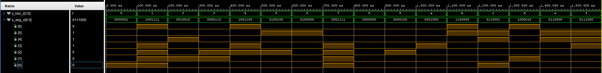
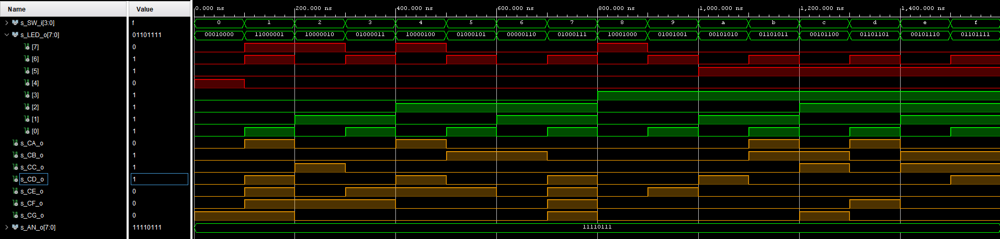

# Lab 4: Seven-segment display decoder

[Github repository](https://github.com/mkousal/Digital-electronics-1)

## Seven-segment display connection
Display is connected to FPGA through 8 PNP transistors, they are connected to ANx pins. Display is common anode.

| **Segment/anode pin** | **FPGA register name** | **FPGA package pin** |
| :-: | :-: | :-: |
| CA | IO_L24N_T3_A00_D16_14 | T10 |
| CB | IO_25_14 | R10 |
| CC | IO_25_15 | K16 |
| CD | IO_L17P_T2_A26_15 | K13 |
| CE | IO_L13P_T2_MRCC_14 | P15 |
| CF | IO_L19P_T3_A10_D26_14 | T11 |
| CG | IO_L4P_T0_D04_14 | L18 |
| DP | IO_L19N_T3_A21_VREF_15 | H15 |
| AN0 | IO_L23P_T3_FOE_B_15 | J17 |
| AN1 | IO_L23N_T3_FWE_B_15 | J18 |
| AN2 | IO_L24P_T3_A01_D17_14 | T9 |
| AN3 | IO_L19P_T3_A22_15 | J14 |
| AN4 | IO_L8N_T1_D12_14 | P14 |
| AN5 | IO_L14P_T2_SRCC_14 | T14 |
| AN6 | IO_L23P_T3_35 | K2 |
| AN7 | IO_L23N_T3_A02_D18_14 | U13 |

## Decoder conversion table for common anode 7-segment display

| **Hex** | **Inputs** | **A** | **B** | **C** | **D**| **E** | **F** | **G** |
| :-: | :-: | :-: | :-: | :-: | :-: | :-: | :-: | :-: |
| 0 | 0000 | 0 | 0 | 0 | 0 | 0 | 0 | 1 |
| 1 | 0001 | 1 | 0 | 0 | 1 | 1 | 1 | 1 |
| 2 | 0010 | 0 | 0 | 1 | 0 | 0 | 1 | 0 |
| 3 | 0011 | 0 | 0 | 0 | 0 | 1 | 1 | 0 |
| 4 | 0100 | 1 | 0 | 0 | 1 | 1 | 0 | 0 |
| 5 | 0101 | 0 | 1 | 0 | 0 | 1 | 0 | 0 |
| 6 | 0110 | 0 | 1 | 0 | 0 | 0 | 0 | 0 |
| 7 | 0111 | 0 | 0 | 0 | 1 | 1 | 1 | 1 |
| 8 | 1000 | 0 | 0 | 0 | 0 | 0 | 0 | 0 |
| 9 | 1001 | 0 | 0 | 0 | 0 | 1 | 0 | 0 |
| A | 1010 | 0 | 0 | 0 | 1 | 0 | 0 | 0 |
| b | 1011 | 1 | 1 | 0 | 0 | 0 | 0 | 0 |
| C | 1100 | 0 | 1 | 1 | 0 | 0 | 0 | 1 |
| d | 1101 | 1 | 0 | 0 | 0 | 0 | 1 | 0 |
| E | 1110 | 0 | 1 | 1 | 0 | 0 | 0 | 0 |
| F | 1111 | 0 | 1 | 1 | 1 | 0 | 0 | 0 |

## Seven segment display decoder

### VHDL architecture
```vhdl
architecture Behavioral of hex_7seg is

begin

    p_7seg_decoder : process(hex_i)
    begin
        case hex_i is
            when "0000" =>
                seg_o <= "0000001";     -- 0
            when "0001" =>
                seg_o <= "1001111";     -- 1
            when "0010" =>
                seg_o <= "0010010";     -- 2
            when "0011" =>
                seg_o <= "0000110";     -- 3
            when "0100" =>
                seg_o <= "1001100";     -- 4
            when "0101" =>
                seg_o <= "0100100";     -- 5
            when "0110" =>
                seg_o <= "0100000";     -- 6
            when "0111" =>
                seg_o <= "0001111";     -- 7
            when "1000" =>
                seg_o <= "0000000";     -- 8
            when "1001" =>
                seg_o <= "0000100";     -- 9
            when "1010" =>
                seg_o <= "0001000";     -- A
            when "1011" =>
                seg_o <= "1100000";     -- b
            when "1100" =>
                seg_o <= "0110001";     -- C
            when "1101" =>
                seg_o <= "1000010";     -- d    
            when "1110" =>
                seg_o <= "0110000";     -- E
            when others =>
                seg_o <= "0111000";     -- F
        end case;
    end process p_7seg_decoder;

end Behavioral;
```

### Testbench stimulus process
```vhdl
architecture Behavioral of tb_hex_7seg is

    signal s_hex_i : std_logic_vector (4 - 1 downto 0);
    
    signal s_seg_o : std_logic_vector (7 - 1 downto 0);

begin
    uut_hex_7seg : entity work.hex_7seg
        port map(
            hex_i => s_hex_i,
            seg_o => s_seg_o
        );
        
        p_stimulus : process
        begin
            report "Simulation started" severity note;
            
            s_hex_i <= "0000"; wait for 100 ns;
            s_hex_i <= "0001"; wait for 100 ns;
            s_hex_i <= "0010"; wait for 100 ns;
            s_hex_i <= "0011"; wait for 100 ns;
            s_hex_i <= "0100"; wait for 100 ns;
            s_hex_i <= "0101"; wait for 100 ns;
            s_hex_i <= "0110"; wait for 100 ns;
            s_hex_i <= "0111"; wait for 100 ns;
            s_hex_i <= "1000"; wait for 100 ns;
            s_hex_i <= "1001"; wait for 100 ns;
            s_hex_i <= "1010"; wait for 100 ns;
            s_hex_i <= "1011"; wait for 100 ns;
            s_hex_i <= "1100"; wait for 100 ns;
            s_hex_i <= "1101"; wait for 100 ns;
            s_hex_i <= "1110"; wait for 100 ns;
            s_hex_i <= "1111"; wait for 100 ns;
            
            
            report "simulation end" severity note;
            wait;    
        end process p_stimulus;

end Behavioral;
```

### Simulated waveform


### VHDL code of `top.vhd` file
```vhdl
----------------------------------------------------------------------------------
-- Company: 
-- Engineer: 
-- 
-- Create Date: 03.03.2021 13:52:47
-- Design Name: 
-- Module Name: top - Behavioral
-- Project Name: 
-- Target Devices: 
-- Tool Versions: 
-- Description: 
-- 
-- Dependencies: 
-- 
-- Revision:
-- Revision 0.01 - File Created
-- Additional Comments:
-- 
----------------------------------------------------------------------------------

library IEEE;
use IEEE.STD_LOGIC_1164.ALL;

-- Uncomment the following library declaration if using
-- arithmetic functions with Signed or Unsigned values
--use IEEE.NUMERIC_STD.ALL;

-- Uncomment the following library declaration if instantiating
-- any Xilinx leaf cells in this code.
--library UNISIM;
--use UNISIM.VComponents.all;

entity top is
--  Port ( );
    port (
        SW  : in std_logic_vector (4 - 1 downto 0);
        
        LED : out std_logic_vector (8 - 1 downto 0);
        CA  : out std_logic;
        CB  : out std_logic;
        CC  : out std_logic;
        CD  : out std_logic;
        CE  : out std_logic;
        CF  : out std_logic;
        CG  : out std_logic;
        AN  : out std_logic_vector (8 - 1 downto 0)
    );
            
end top;

architecture Behavioral of top is

begin

    hex2seg : entity work.hex_7seg
        port map(
            hex_i => SW,
            seg_o(6) => CA,
            seg_o(5) => CB,
            seg_o(4) => CC,
            seg_o(3) => CD,
            seg_o(2) => CE,
            seg_o(1) => CF,
            seg_o(0) => CG
        );
          
    AN <= b"1111_0111"; -- Connect display 3 anode to 3V3
    
    LED(3 downto 0) <= SW; -- Display input value form switches to LEDs 
    
    LED(4) <= '1' when (SW = "0000") else '0'; -- '1' when SW = "0000"
    
    LED(5) <= '1' when (SW > "1001") else '0'; -- '1' when SW > 9
    
    LED(6) <= '1' when (SW(0) = '1') else '0'; -- '1' when SW is odd
    
    LED(7) <= '1' when (SW = "0001") or -- '1' when SW is power of 2
                   (SW = "0010") or
                   (SW = "0100") or
                   (SW = "1000")
                   else '0';
end Behavioral;
```

## LED(7:4) indicators

### Truth table

| **Hex** | **Inputs** | **LED4** | **LED5** | **LED6** | **LED7**| 
| :-: | :-: | :-: | :-: | :-: | :-: | 
| 0 | 0000 | 1 | 0 | 0 | 0 | 
| 1 | 0001 | 0 | 0 | 1 | 1 | 
| 2 | 0010 | 0 | 0 | 0 | 1 | 
| 3 | 0011 | 0 | 0 | 1 | 0 | 
| 4 | 0100 | 0 | 0 | 0 | 1 | 
| 5 | 0101 | 0 | 0 | 1 | 0 | 
| 6 | 0110 | 0 | 0 | 0 | 0 | 
| 7 | 0111 | 0 | 0 | 1 | 0 | 
| 8 | 1000 | 0 | 0 | 0 | 1 | 
| 9 | 1001 | 0 | 0 | 1 | 0 |
| A | 1010 | 0 | 1 | 0 | 0 |
| b | 1011 | 0 | 1 | 1 | 0 |
| C | 1100 | 0 | 1 | 0 | 0 |
| d | 1101 | 0 | 1 | 1 | 0 |
| E | 1110 | 0 | 1 | 0 | 0 |
| F | 1111 | 0 | 1 | 1 | 1 |

### VHDL code for LEDs(7:4)
```vhdl
    LED(4) <= '1' when (SW = "0000") else '0'; -- '1' when SW = "0000"
    
    LED(5) <= '1' when (SW > "1001") else '0'; -- '1' when SW > 9
    
    LED(6) <= '1' when (SW(0) = '1') else '0'; -- '1' when SW is odd
    
    LED(7) <= '1' when (SW = "0001") or -- '1' when SW is power of 2
                   (SW = "0010") or
                   (SW = "0100") or
                   (SW = "1000")
                   else '0';
```

### Simulated waveform
